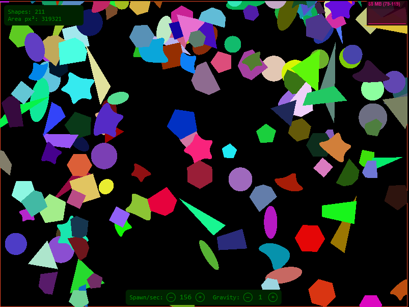
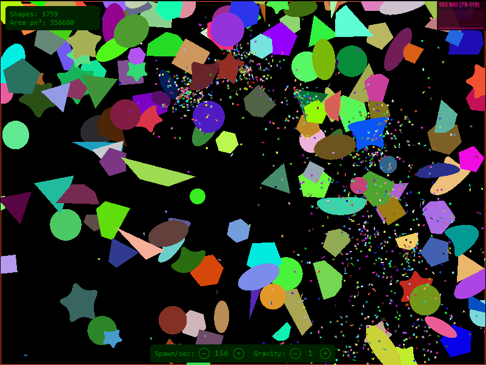
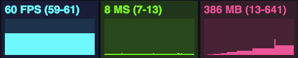

# PixiJS Falling Shapes

PixiJS app that renders random shapes inside a rectangular area, with gravity and HTML controls.

## Builded version

https://romanminchenko.github.io/pixi-falling-shapes-mvc-objectPool/

## Installation

### Install
```bash
npm install
```

### Dev server
```bash
npm run dev
```
Open the printed URL (usually `http://localhost:8080`).

### Build
```bash
npm run build
```
Outputs to `dist/`.

## Screenshots



---

# Performance Monitor

- **FPS**: Frames rendered in the last second. The higher the number the better.  
- **MS**: Milliseconds needed to render a frame. The lower the number the better.  
- **MB**: MBytes of allocated memory (requires running Chrome with `--enable-precise-memory-info`).  

## Usage
By clicking on the monitor, you can switch between them.

## Screenshots


## Source
[stats.js](https://github.com/mrdoob/stats.js)

---

## 📝 License
MIT (https://choosealicense.com/licenses/mit/)
